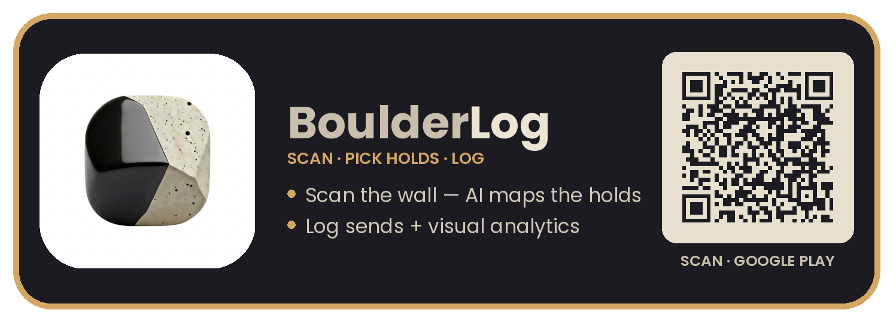
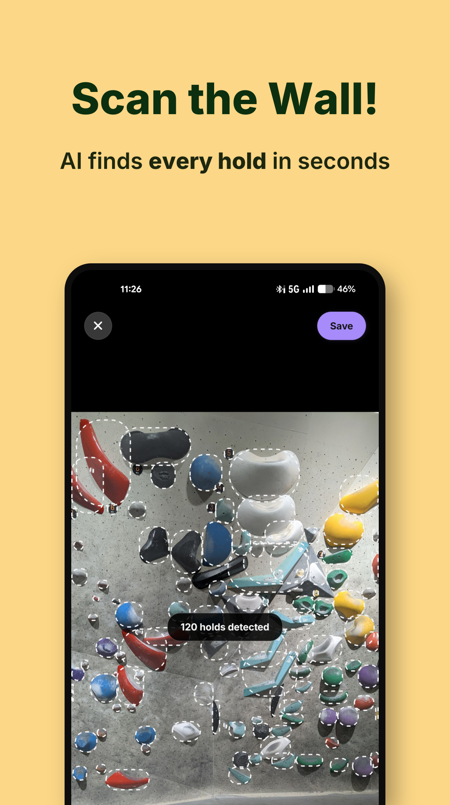
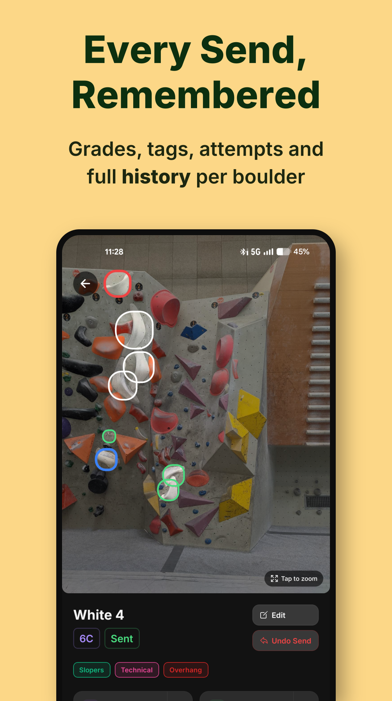
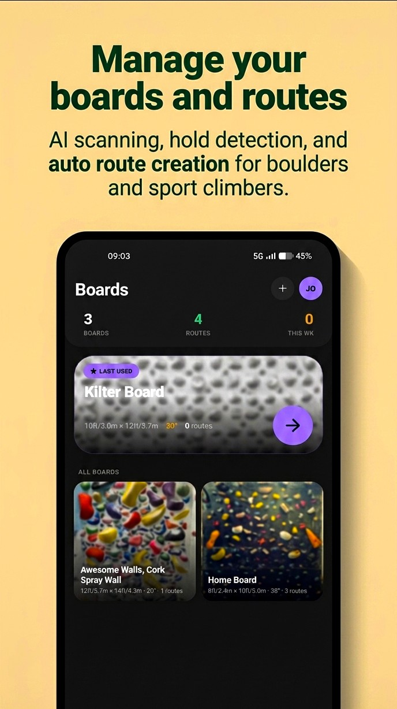
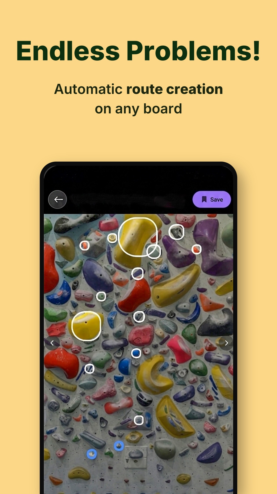
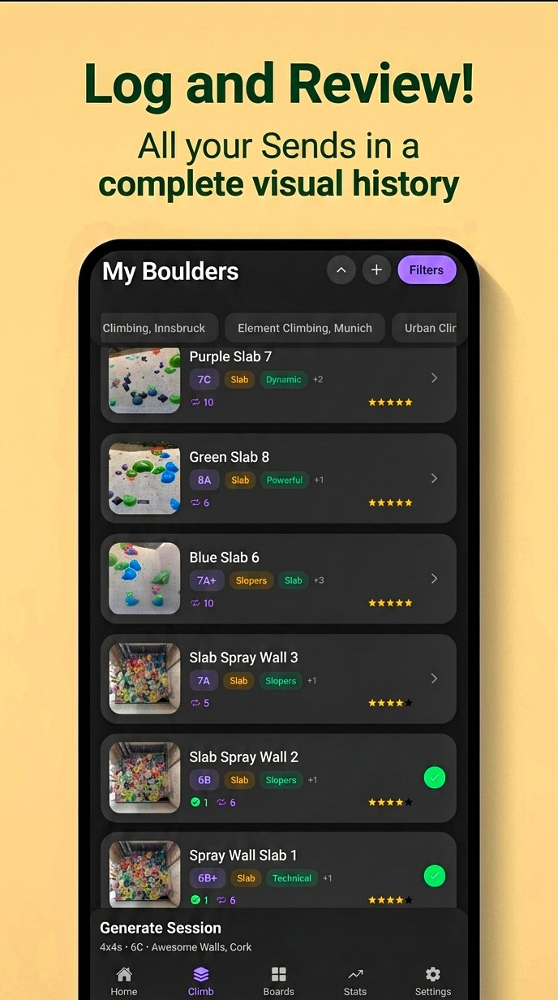

  

<h1 align="center">BoulderLog</h1>

  <b>Your climbing wall, mapped by AI. Your progress, made visible.</b> 
  The complete bouldering companion — logbook · analytics · training engine · route setter, in one app.

  

  
  
  
  

<h3 align="center">
  &nbsp; SCAN
  &nbsp;&nbsp;→&nbsp;&nbsp;
  &nbsp; PICK HOLDS
  &nbsp;&nbsp;→&nbsp;&nbsp;
  &nbsp; LOG
</h3>

  Point your camera at the wall and BoulderLog's on-device AI instantly finds every hold — no drawing shapes,
  no dropping pins, no fiddly editors. Tap the holds in your problem, set the grade, and it's in your logbook. 
  Chalky-fingers friendly · designed for dim gyms · fast enough to use between attempts.

  
  &nbsp;&nbsp;&nbsp;
  

##  Capture routes the way setters think

<table>
<tr>
<td width="50%" valign="top">

**AI hold detection**
A custom neural network runs entirely on your phone and maps the wall in a snap. Any gym, no signal required.

**Real hold roles**
Mark holds as **start · hand · foot · zone · finish** so your route reads like an actual problem.

**Pinch-zoom precision**
Zoom and pan while picking holds — built for crowded comp walls.

</td>
<td width="50%" valign="top">

**Freehand beta drawing**
Sketch movement lines and annotations straight onto the route photo.

**30 style tags + 8 rule tags**
Crimps, Slopers, Dyno, Compression, Roof, Slab, Mantle… plus Feet-Follow-Hands, Sit Start, No Matching and more.

**Grades, areas, ratings & projects**
Full Font scale (5 → 8C), organize by gym, star-rate the classics, flag your projects.

</td>
</tr>
</table>

##  Your home wall. Infinite fresh problems.

Turn any spray wall, home woody, or systems board into a **digital twin** — then let BoulderLog set the routes for you.

  
  &nbsp;&nbsp;&nbsp;
  

**Build the board once**
- Photograph it and set the real geometry: **width (6–15 ft), height, and wall angle in degrees**.
- Mark the **kickboard** and height zones — base · low · mid · standing.
- Tag each hold's type, orientation, and difficulty once; the board remembers them forever.

**Generate a brand-new problem with one tap**
- Dial in a **target grade, route length, and style focus** — BoulderLog sets a fresh, never-seen problem instantly.
- **Linear problems or endurance circuits** — circuits sweep the wall with your choice of direction and foot density.
- Fine control over **start pair, start zone, start side, and foot rules**.
- Every route is **grade-estimated** as it's built, so you know what you're pulling on.

**Routes that actually climb**
The generator doesn't just connect dots. It runs a **biomechanical body model** — simulating both hands and your center of mass, checking reach at *your* height and each hold's orientation — so generated problems move like something a human setter would build, not a random scatter.

**Whole training sessions, auto-set**
Generate an entire **pyramid session** — warmup → build → work → limit — as a stack of fresh routes in a single tap. Per-board settings are saved, and board problems stay cleanly separated from your gym boulders with their own stats.

##  Beta videos, attached to the boulder

Record or attach beta videos directly to each route. Rewatch your send, study your beta, and back up your entire video library to a single file whenever you want.

##  A logbook that looks like your climbing

Every problem is stored with its photo and highlighted holds — flick back through your history and *see* your climbing, not just a list of numbers.

  

- **Sends & attempts** logged with full date history per route.
- **Project tracking** keeps your long-term battles front and center until the send.
- **Powerful library filters** — search plus stackable filters for grade, status, styles, rules, rating, area, and board. Find *"all unsent 7A crimp problems at my gym"* in two taps.

##  Thirteen charts. Zero spreadsheets.

A full analytics dashboard turns your logbook into insight:

| | | |
|---|---|---|
| **The Climbing Pyramid** | **Send Distribution** | **Sends by Grade** |
| **Attempts vs Sends** | **Monthly Sends** | **Monthly Trends by Grade** |
| **Advanced Metrics** | **Performance Trends** | **90-Day Consistency** |
| **Climbing Styles** | **Sends by Angle** | **Area of Focus** |
| **Nemesis Boulders** — most-attempted, still unsent | | |

##  A training engine, not just a timer

Tell BoulderLog your target grade and it builds a structured interval session **from your own logged boulders**:

| Protocol | What you get |
|---|---|
| **4×4** | The classic power-endurance crusher |
| **3×3** | Shorter blocks, higher intensity |
| **EMOM** | Every minute on the minute |
| **1-on / 1-off** | Relentless minute intervals |
| **Pyramids** | A grade ladder built around your target — up to the peak and back down |
| **Comp Sim** | Simulate a real competition: qualification, semis, or finals format |

The built-in **session player** runs the show — phase timers, audio cues, pause/skip controls, and a screen that stays awake while you climb — then a **review screen** to log what you sent.

##  Yours. Offline. Forever.

- **Everything stays on your phone** — photos, videos, logs, and the AI itself. Nothing is uploaded, ever.
- **No account, no cloud, no subscription.** Install and climb.
- **One-tap full backup** — your entire logbook (photos included) exports to a single file; restore on any device.
- **Separate video backup** to keep archives lean, plus built-in thumbnail repair and cache cleanup.

<h3 align="center">Built for performance</h3>

  
  
  
  
  

  New Architecture · 120fps Reanimated gestures · hand-tuned TFLite vision model on device —
  because a logging app should never slow down your session.

<b>Stop guessing. Start seeing your climbing.</b>

<h3 align="center">Download</h3>

  
  <!--
    Add other stores as you publish — just swap the href and delete the surrounding comment.
    
    
    
    
  -->

<i>Scan · Pick Holds · Log</i>

